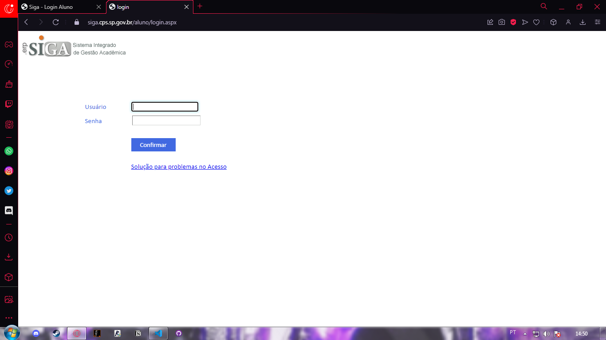
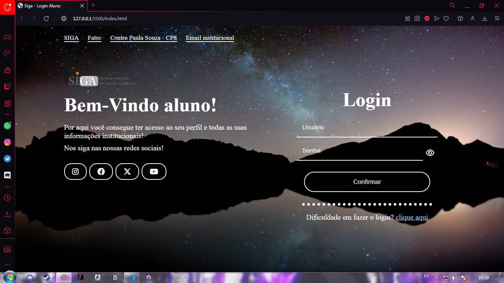
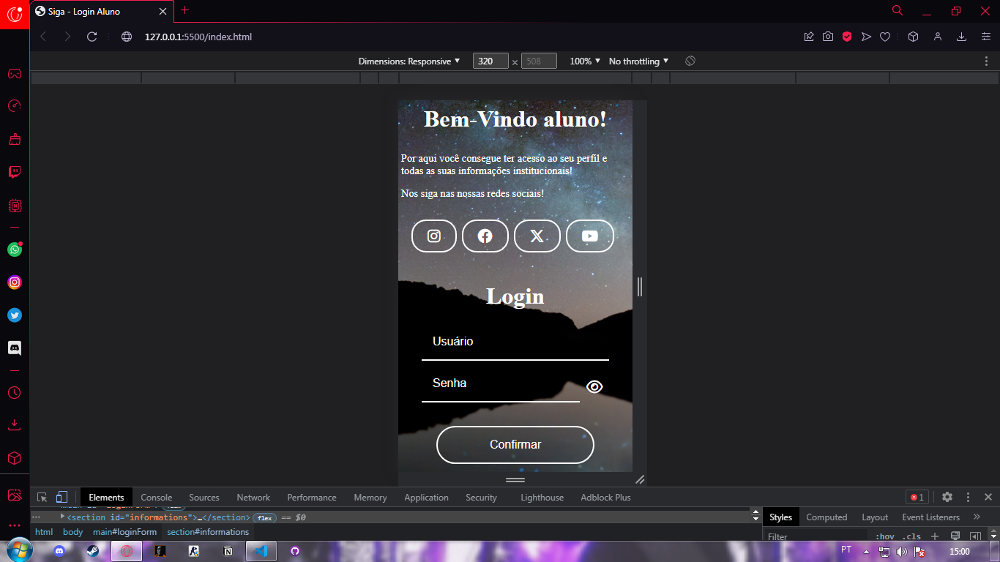

Site oficial:
>

Meu site (pc):

Meu site(celular):

Olá! Tudo bem? Seja muito bem-vindo ao meu projeto de recriação da tela de login da minha faculdade!!
A tela de login é muito fraca no quesito de bem estar do usuário, pelo fato de não ter a responsividade para os diversos tamanhos de tela e dispositivos que temos hoje em dia, fica inviavel usar o site pelo celular ou telas grandes, e pessoas com deficiencia vizual sofrem com a falta de acessibilidade, pois quando vou usar o celular preciso dar vários zooms imagina quem não tem um celular bom ou alguma deficiencia, então, pensando nessas pessoas e pensando na melhoria do site eu o recriei adicionando várias novas funcionalidades úteis, até mesmo para a divulgação das redes sociais e outros sites referentes a faculdade, e obviamente também melhorando a responsividade, deixando o site agradável para quem for usar!

Enfim, desejo que goste desta tela de login e caso encontre algo que pode ser melhorado eu amaria saber, aceito sempre dicas construtivas!!
Muito obrigado pelo a atenção e até próxima!!